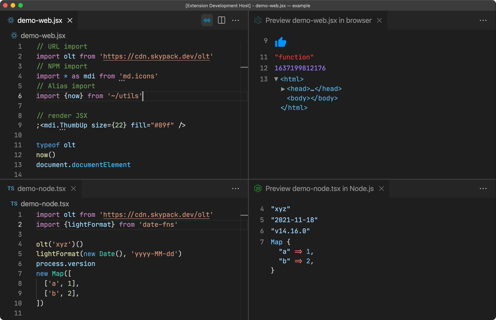

# Live Code

Interactive code playground.

## Features

- Automatically evaluate all top-level expressions
- Support multiple environments (browser/Node.js)
- Support TypeScript/JSX
- Support URL imports
- Support custom [paths](https://www.typescriptlang.org/tsconfig/#paths) in tsconfig or jsconfig
- Support top-level await (browser only)
- Render JSX elements (browser only)

TODO:

- [ ] Support Deno
- [ ] Run code block in Markdown/MDX

## Usage

Open _Command Palette_, choose `Live Code: Open Preview to the Side`, or simply click the preview button in the title, or use the shortcut `cmd` + `k l`.



## Requirements

- [Node.js](https://nodejs.org/) v12+

## Extension Settings

```json
{
  "liveCode.defaultPlatform": {
    "type": "string",
    "default": "browser",
    "description": "Set the execution environment of the preview",
    "enum": ["browser", "node"]
  },
  "liveCode.renderJSX": {
    "type": "boolean",
    "default": true,
    "description": "Wether to render JSX elements in the preview panel (browser platform only)"
  },
  "liveCode.showLineNumbers": {
    "type": "boolean",
    "default": true,
    "description": "Wether to show line numbers in the preview panel"
  }
}
```
